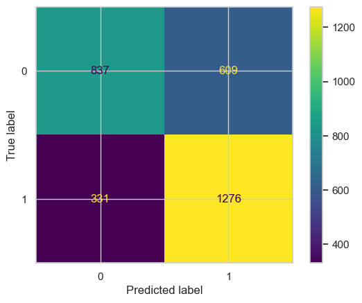
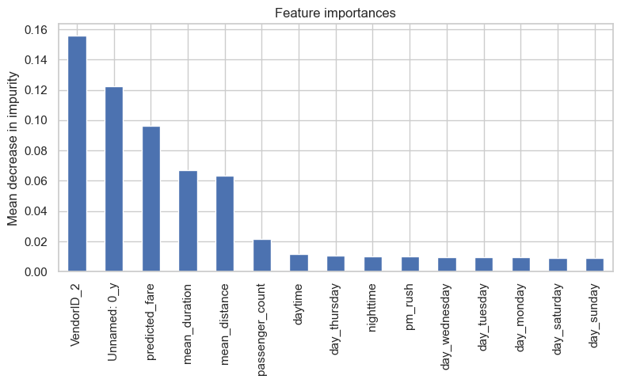

# TLC (New York City Taxi and Limousine Commission)

## Overview
New York City TLC is an agency responsible for licensing and regulating New York City's taxi cabs and for-hire vehicles. The agency want to develop a regression model that helps estimate taxi fares before the ride, based on data that TLC has gathered. 

## Business Understanding
The New York City Taxi and Limousine Commission (TLC) is tasked with overseeing and regulating a massive transportation network that includes taxi cabs and for-hire vehicles. With over 200,000 licensees and approximately one million combined trips per day, managing and optimizing the fare estimation process is crucial.

The primary objective is to create a regression model capable of accurately estimating taxi fares in advance. This model will not only benefit passengers by providing more transparency in fare calculation but also help drivers and TLC in ensuring fair pricing across the city's extensive transportation network. By harnessing the power of data analysis and machine learning, this project aims to improve the overall taxi and limousine experience in New York City.

## Data Understanding
### DataFrame Shape:
- Number of Rows: 22,699
- Number of Columns: 18

### Column Information:
- Unnamed: 0: Trip identification number.

- VendorID: A code indicating the TPEP provider that provided the record:
    - 1= Creative Mobile Technologies, LLC; 
    - 2= VeriFone Inc.

- tpep_pickup_datetime: The date and time when the meter was engaged. 

- tpep_dropoff_datetime:The date and time when the meter was disengaged.

- passenger_count: The number of passengers in the vehicle, This is a driver-entered value.

- trip_distance: The elapsed trip distance in miles reported by the taximeter.

- RatecodeID: The final rate code in effect at the end of the trip. 
    - 1= Standard rate 
    - 2=JFK 
    - 3=Newark 
    - 4=Nassau or Westchester 
    - 5=Negotiated fare 
    - 6=Group ride.

- store_and_fwd_flag: This flag indicates whether the trip record was held in vehicle memory before being sent to the vendor, aka “store and forward,”  because the vehicle did not have a connection to the server. 
    - Y= store and forward trip 
    - N= not a store and forward trip.

- PULocationID: TLC Taxi Zone in which the taximeter was engaged.

- TLC Taxi Zone in which the taximeter was disengaged.

- payment_type:A numeric code signifying how the passenger paid for the trip.  
    - 1= Credit card 
    - 2= Cash 
    - 3= No charge 
    - 4= Dispute 
    - 5= Unknown 
    - 6= Voided trip.

- fare_amount: The time-and-distance fare calculated by the meter.

- extra: Miscellaneous extras and surcharges. Currently, this only includes the $0.50 and $1 rush hour and overnight charges.

- mta_tax: $0.50 MTA tax that is automatically triggered based on the metered rate in use.

- tip_amount: This field is automatically populated for credit card tips. Cash tips are not included.

- tolls_amount: Total amount of all tolls paid in trip.

- improvement_surcharge: $0.30 improvement surcharge assessed trips at the flag drop. The  improvement surcharge began being levied in 2015.

- total_amount: The total amount charged to passengers. Does not include cash tips.

### Data Types:
- There are three data types present in this DataFrame:
- Integer (int64): 7 columns
- Float (float64): 8 columns
- Object (string): 3 columns

## Modeling and Evaluation
they stakeholder asked to build a model that's  predict whether the customer will leave tip or not but that's not ethically correct and could harm the business ! Why ? lets take for example :

- Drivers who didn't receive tips will probably be upset that the app told them a customer would leave a tip. If it happened often, drivers might not trust the app. Drivers are unlikely to pick up people who are predicted to not leave tips. Customers will have difficulty finding a taxi that will pick them up, and might get angry at the taxi company. Even when the model is correct, people who can't afford to tip will find it more difficult to get taxis, which limits the accessibility of taxi service to those who pay extra.

- We can overtake this by building a model thats predict people who are particularly generous—those who will tip 20% or more.

Random forest and XGBoost used for modling and selects the best performance model to test the data.

### confusion_matrix for random_forest model: 

### confusion_matrix for random_forest model: 

- Random forest F1 Score : 0.728442.
- XGBoost : 0.697756.

## Conclusion
In conclusion, while the initial request was to build a model predicting whether customers will leave tips or not, ethical considerations have led us to reconsider the approach. Predicting whether a customer will leave a tip can have negative consequences for both drivers and the overall accessibility of the taxi service.

Drivers who are repeatedly informed that a customer will leave a tip, only to find that they do not, may become disillusioned and lose trust in the system. This could lead to drivers being hesitant to pick up passengers predicted not to leave tips, creating difficulties for customers in finding available taxis. Such a scenario may also result in dissatisfaction and frustration among customers, potentially impacting the reputation of the taxi company.

To address these ethical concerns, we propose an alternative approach. Instead of predicting tips in a binary manner, we aim to identify those customers who are particularly generous, likely to tip 20% or more. This approach not only refrains from causing potential harm but also focuses on rewarding and acknowledging generous customers.

In our model development, we leveraged Random Forest and XGBoost algorithms to achieve the best possible performance. The Random Forest model achieved an F1 Score of 0.728442, while XGBoost achieved a score of 0.697756. These results indicate that our model can effectively identify generous customers, thereby promoting a more positive interaction between passengers and taxi drivers, without compromising ethical considerations or causing harm to the business.